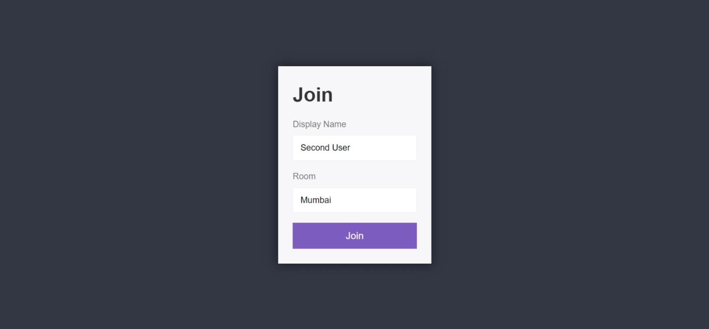
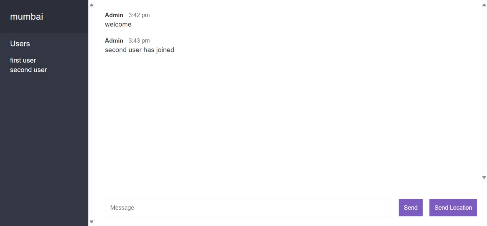

### Chat Application

Project based on **Node.js**, it provides real time server for multiple users to chat with each other.

### Pre Requisites

- **Node.js** version **21** or greater.

### Dependencies used by the project

1. **express**.
2. **socket.io**.

### Dev Dependencies used by the project

1. **env-cmd**.
2. **nodemon**.

### Available scripts

1. `npm start` for running the application in production environment.

2. `npm run dev` for running the application in development environment.

### Required environment variables

1. `PORT` provides the PORT number for the application in the production environment.

### Instructions

1. Visit `http://localhost:3000` in the browser.

2. The home page of the application looks like this, enter the Name and Server Name. 

3. Same for the second user as well. 

4. The server interface after all the users are joined in the server. 
